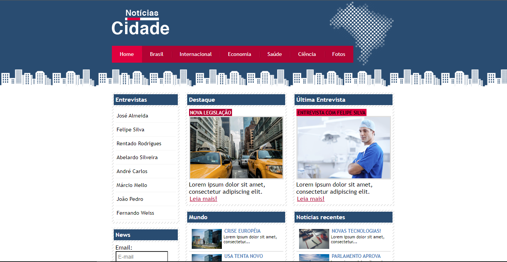

<h1 align="center"> Notícias Cidade </h1>

Site fictício criado apenas para simular como seria uma página de noticia local apenas com conceitos básicos de HTML e CSS.  

  <a href="#-tecnologias">Tecnologias</a>&nbsp;&nbsp;&nbsp;|&nbsp;&nbsp;&nbsp;
  <a href="#-projeto">Projeto</a>&nbsp;&nbsp;&nbsp;|

  

 

  

## 🚀 Tecnologias

Esse projeto foi desenvolvido com as seguintes tecnologias:

- HTML e CSS
- Git e Github

## 💻 Projeto

Pagina criada com o intuito de treinar as habilidades com HTML e  CSS simulando uma pagína de notícias local.

- [Visite o projeto online](https://danrodriguezdev.github.io/Noticias-Cidade)
